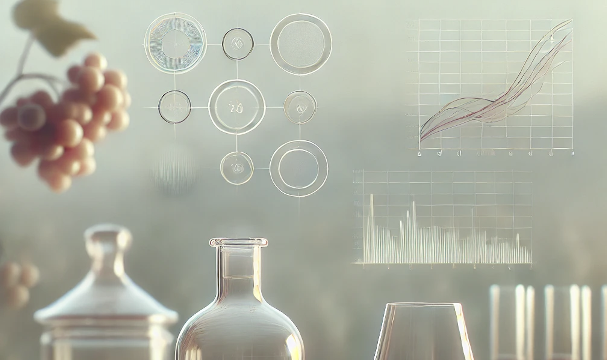

# Wine Quality Prediction



## Project Objective
- The aim of this analysis is to predict the quality of new wines without resorting to expert assessment. To this end, 6497 wines are registered, data from their respective chemical analyses, and the evaluation of experts. Using two datasets consisting on physicochemical data from red and white Vinho Verde wine samples, from the north of Portugal, and a quality classification, our client wants to build an application to automatically classify new samples of Vinho Verde.

The Wine Quality dataset contains information about various physicochemical properties of wines.
This dataset only has numeric variables:
    
| FEATURES | DESCRIPTION | VARIABLE TYPE
|:-------|:-------|:-------|
**fixed acidity:**| Influences the flavor of the wine. A significant reduction in acids can lead to wines that taste flat. Examples of fixed acids are tartaric, malic, citric, and succinic, which can be found in grapes (except succinic). It is measured in g/dm3.|Continuous numerical|
**volatile acidity:**| These acids must be distilled out from the wine before the end of the production process. Excess of volatile acids are undesirable and lead to unpleasant flavor. It is measured in g/dm3.|Continuous numerical|
**citric acid:**| The amount of citric acid in the wine, which most of it is usually consumed during the fermentation process. It acts as a preservative and small quantities can add freshness and flavor. It is measured in g/dm3.|Continuous numerical|
**residual sugar:**| The amount of sugar remaining after the end of the fermentation. The goal is to have a perfect balance between sweetness and sourness. Wines with more than 45g/dm3 are considered sweet. It is measured in g/dm3.|Continuous numerical|
**chlorides:**| The amount of salt in the wine.|Continuous numerical|
**free sulfur dioxide:**| The amount of sulfur dioxide (SO2) in free form. They are also known as sulfites and too much of it is undesirable and gives a pungent odour. It is measured in g/dm3.|Continuous numerical|
**total sulfur dioxide:**| The total amount of SO2 in the wine. This is added to kill harmful bacteria and preserve quality and freshness. It is measured in mg/dm3.|Continuous numerical|
**density:**| It is used as a measure of the conversion of sugar to alcohol. Sweeter wines have higher density.|Continuous numerical|
**pH:**| Describes how acidic or basic a wine is on a scale from 0 (very acidic) to 14 (very basic).|Continuous numerical|
**sulphates:**| The amount of mineral salts containing sulfur in the wine. It is an additive which can contribute to sulfur dioxide gas (S02) levels and acts as an antimicrobial and antioxidant. They are related to the fermentation process and affect the aroma and flavor of the wine.|Continuous numerical|
**alcohol:**| Alcohol is formed as a result of yeast converting sugar during the fermentation process. It's usually measured in % volume or alcohol by volume (ABV).|Continuous numerical|
**quality:**| A quality label in the range of 0 (very bad) to 10 (very excellent). It is the median of at least three evaluations made by wine experts.|Discrete numerical|
**type:**| Wine type - In this case can be white or red.|Nominal Categorical|

## CRISP-DM Framework
This project follows the CRISP-DM methodology, covering the following steps:
- Business Understanding
- Data Understanding
- Data Preparation
- Modeling
- Evaluation
- Deployment

## Project Structure
- `data/`: Contains raw and processed datasets.
- `notebooks/`: Jupyter notebooks for each step of the CRISP-DM process.
- `src/`: Python scripts for data cleansing, EDA, modeling, and deployment.
- `app/`: Deployed APP of the wine quality prediction model.
- `reports/`: Reports and figures generated during the project.
- `models/`: Saved models and their performance metrics.

## Using
Check for 'which python' and 'python --version'

Install python3.11.7:
    -> run python3.11.7 -m venv venv

Windows -> venv\Scripts\activate 
Mac -> source venv/bin/activate

Check for 'which python' and 'python --version'

In terminal to activate python enviroment 'source venv/bin/activate' for mac and venv\Scripts\activate for windows, be sure to be in root folder /wine-quality-prediction.

If deployment doesn't work, run: python3 app/runNotebook.py inside the enviroment to produce the models at the same librarys as the execution of python3 app/app.py

## Installation
To install the necessary packages, run:
```bash
pip install -r app/requirements.txt
